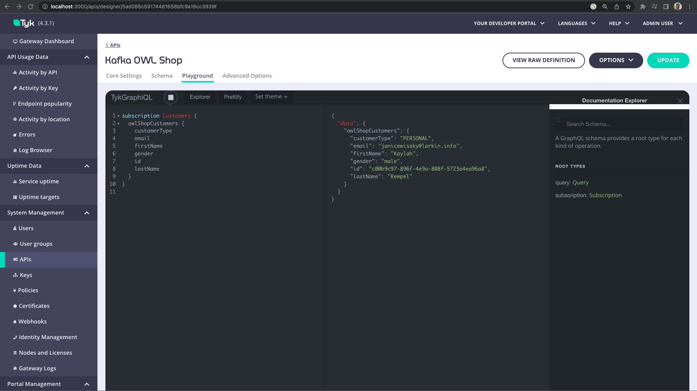

# Exposing Redpanda Data Kafka topics via GraphQL using Tyk

## About

This demonstrates how to configure [Tyk Gateway](https://github.com/TykTechnologies/tyk), [Redpanda](https://redpanda.com/), [Redpanda Console](https://docs.redpanda.com/docs/platform/console/) and [OWL Shop](https://github.com/cloudhut/owl-shop) to expose data coming from a Red Panda Kafka broker via GraphQL using Universal Data Graph

Redpanda streaming data platfrom will receive the data from OWL shop and make the topics available to be proxied by Tyk as GraphQL.




  
## Setup

1. Run the `up.sh` script with the `kafka` parameter:

```
./up.sh kafka
```
## Play around

1. Check the different topics en Redpanda Console

Open the Redpanda console and go to the topics tab

```
http://localhost:8090/topics
```

Click on the owlshop-customers and on the + symbol to expand the items from the values.


2. Check out the dashboard in Tyk

Go to [Tyk Dashboard](http://localhost:3000/) in your browser, open the API section and access to the Kafka OWL Shop Playground


Click the play button and see the data coming in:

